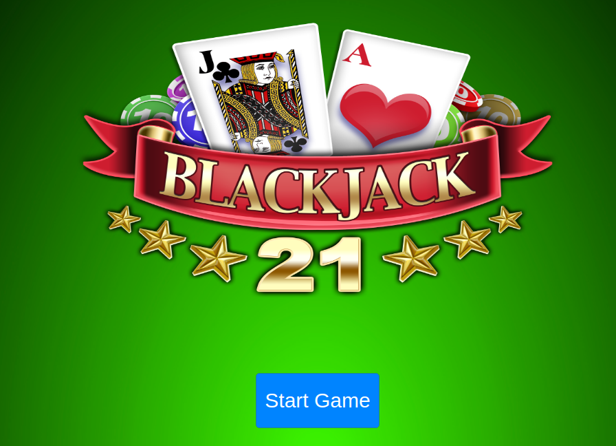

# Blackjack

This is a reproduction of a classic card game called Blackjack or twenty-one as part of my Web Development course at Ironhack Brazil.

## Game rules

The goal is to beat the dealer's hand without going over 21. 

The numeral cards have their face values, face cards are value 10 and Aces are valued at 11.

The player and the dealer starts with two cards, one of the dealer's cards is hidden until the end.

Click 'hit' to ask for another card and click 'stand' to hold your total and end your turn.

## Prerequisites

No hardware prerequisites needed. Just use your **browser**.

* Click [here](https://cintiathieme.github.io/project-mod1-blackjack-game/) to run the game.

